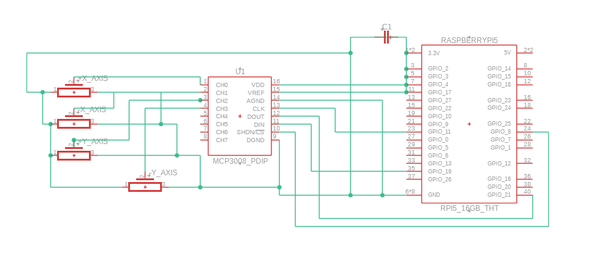

# ROS 2 Prosthetic HMI: Hardware-in-the-Loop Digital Twin

### **Project Overview**
This repository contains a ROS 2 Jazzy implementation of a tactile Human-Machine Interface (HMI) designed to control a 6-DOF prosthetic leg. By bridging legacy analog hardware with modern robotic simulation, this project translates voltage gradients from a vintage 4-axis gimbal into real-time joint state telemetry for a digital twin.

---

### **The Physics: Analog-to-Digital Mapping**
The core logic utilizes a **Linear Interpolation (LERP)** algorithm to map 10-bit raw ADC values to the biomechanical constraints defined in the URDF:

$$\theta = \text{out\_min} + \frac{(\text{raw\_adc} - \text{in\_min}) \times (\text{out\_max} - \text{out\_min})}{\text{in\_max} - \text{in\_min}}$$

* **Input Range:** $0 - 1023$ (Raw ADC units) via the MCP3008.
* **Output Range:** Radians (Joint position limits).
* **Calibration:** A software-level offset was established to account for a **1.0V electrical center**, ensuring a neutral "standing" posture when the joystick is at rest.

---

### **System Architecture**


* **Hardware:** Raspberry Pi 5, MCP3008 ADC, and a 4-Axis Analog Joystick (250kΩ Potentiometers).
* **Simulation Environment:** RViz2 for 3D visualization

---

### **Prerequisites**
To run the full hardware-in-the-loop (HIL) demo, the following environment is required:
* **OS:** Ubuntu 24.04 (Noble Numbat)
* **ROS 2 Distro:** Jazzy Jalisco
* **Python Dependencies:** `spidev`, `rclpy`, `sensor_msgs`

---

### **How to Run**

#### **1. Simulation Mode (Mouse/Slider Control)**
To test the URDF and visualization without hardware:
```bash
ros2 launch prosthetic_leg display.launch.py

#### 2. HIL Mode (Joystick Control)
Launch the visualizer: ros2 launch prosthetic_leg display.launch.py.

Toggle Input: Close the joint_state_publisher_gui slider window to prevent topic contention.

Execute the Bridge:

python3 joystick_bridge.py
